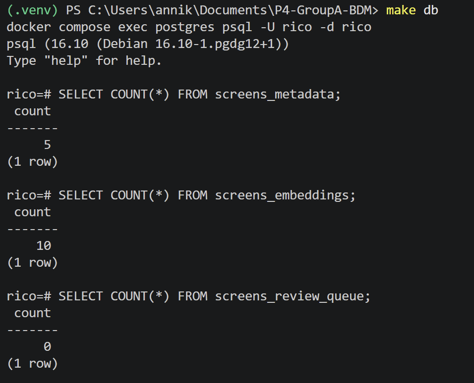
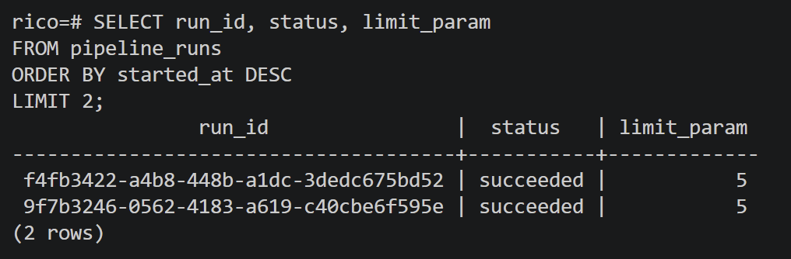
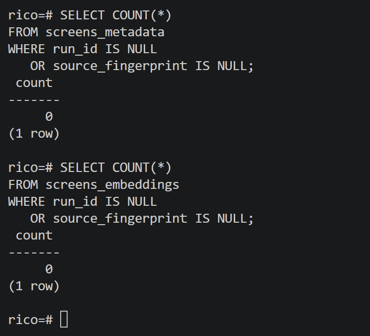
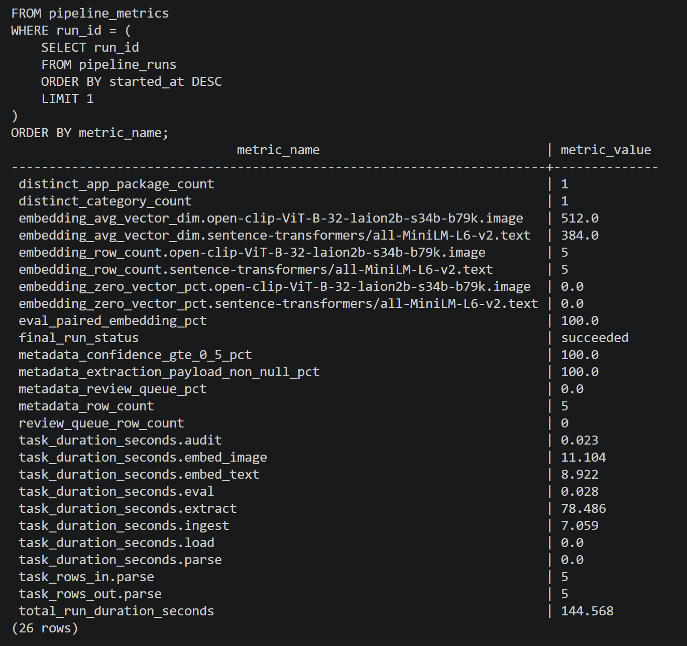
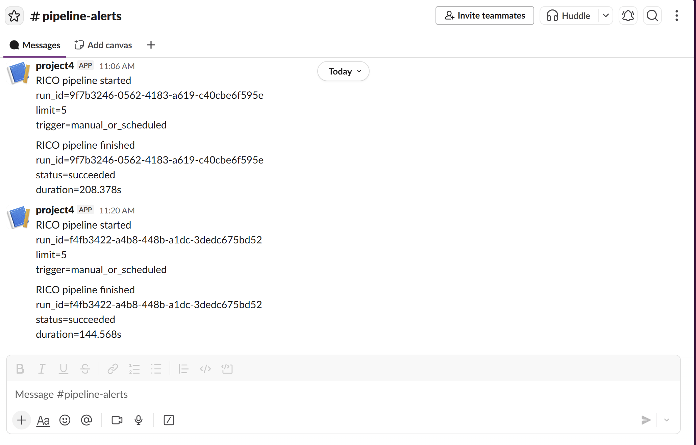
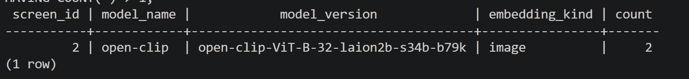
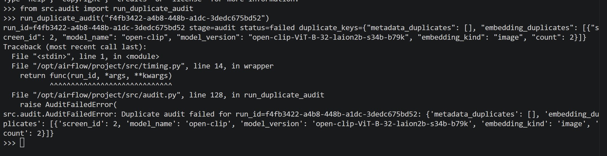
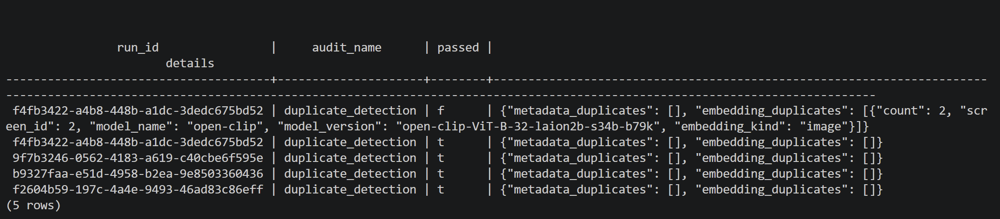
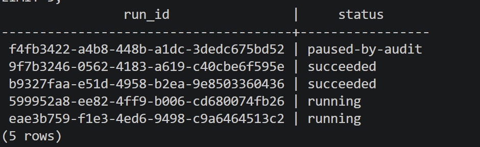
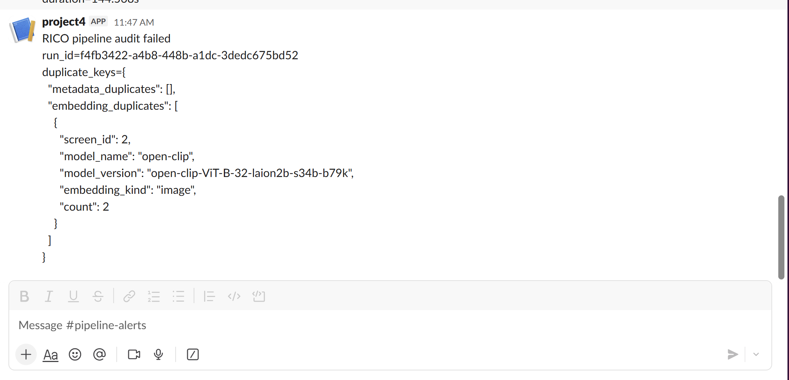

# RICO Multimodal Pipeline

This project converts the original RICO lab notebook into a production-style Airflow pipeline. The pipeline ingests RICO screen data, parses screen metadata, generates image and text embeddings, extracts structured metadata using a local LLM, stores processed outputs in Postgres/pgvector, runs duplicate-detection audits, evaluates embedding coverage, and records observability metrics for every pipeline run.

The DAG is designed to be idempotent and traceable. Each pipeline run receives a unique `run_id`, and all destination rows include both `run_id` and `source_fingerprint` so rows can be traced back to the exact run and source input that produced them. The pipeline also stores run-level metrics in `pipeline_metrics`, audit results in `audit_results`, and sends Slack notifications for pipeline start, audit failure, and successful completion.

The Airflow DAG contains the following stages:

```text
start
  ↓
init_run
  ↓
ingest_task
  ↓
parse_task
  ↓
embed_image_task ┐
embed_text_task  ├─ run in parallel
extract_task     ┘
  ↓
load_task
  ↓
audit_task
  ↓
eval_task
  ↓
finish_task
```

The embedding and extraction tasks run in parallel to improve pipeline throughput. The DAG also supports a configurable `LIMIT` parameter so development and testing can be performed on a small subset of screens, such as `LIMIT=5`, while larger runs can process more data.

## Infrastructure Setup

The project uses Docker Compose to run the full stack:

- Postgres + pgvector
- MinIO
- Ollama
- Airflow

### Start the environment

```bash
make up
```

### Stop the environment

```bash
make down
```

### Full reset (removes all volumes and data)

```bash
make clean
make up
```

### Access Postgre

```bash
make db
```

### Airflow UI

```text
http://localhost:8080
```

Default credentials:

```text
username: admin
password: admin
```

## Database Schema

The Postgres schema is initialized automatically from:

```text
migrations/001_schema.sql
```

The main destination tables are:

- `screens_metadata`
- `screens_embeddings`
- `screens_review_queue`
- `pipeline_runs`
- `pipeline_metrics`
- `audit_results`

## Triggering the DAG

The DAG can be triggered manually from the Airflow UI.

Example configuration:

```json
{
  "LIMIT": 5
}
```
## Idempotency

The pipeline is designed to be idempotent.

Re-running the DAG with the same `LIMIT` value does not create duplicate rows or duplicate embeddings. The pipeline uses deterministic MinIO object paths and PostgreSQL `ON CONFLICT` upserts to avoid duplicate inserts.

### Verify idempotency

Run the DAG twice with the same configuration:

```json
{
  "LIMIT": 5
}
```

Then verify row counts:

```sql
SELECT COUNT(*) FROM screens_metadata;

SELECT COUNT(*) FROM screens_embeddings;

SELECT COUNT(*) FROM screens_review_queue;
```



The counts should remain stable after re-running the DAG.

## Traceability

Each pipeline run receives a unique `run_id`.

All destination rows contain:
- `run_id`
- `source_fingerprint`

This makes every row traceable to:
- the exact pipeline run,
- the exact source input,
- the model versions used during processing.

### Verify traceability

```sql
SELECT run_id, status, limit_param
FROM pipeline_runs
ORDER BY started_at DESC
LIMIT 2;
```



```sql
SELECT COUNT(*)
FROM screens_metadata
WHERE run_id IS NULL
   OR source_fingerprint IS NULL;
```

```sql
SELECT COUNT(*)
FROM screens_embeddings
WHERE run_id IS NULL
   OR source_fingerprint IS NULL;
```

Both validation queries should return:

```text
0
```



## Observability Metrics

Pipeline metrics are stored in:

```text
pipeline_metrics
```

Metrics include:
- per-task duration,
- total run duration,
- embedding quality metrics,
- metadata quality metrics,
- evaluation metrics,
- final pipeline status.

### Example metrics query

```sql
SELECT metric_name, metric_value
FROM pipeline_metrics
WHERE run_id = (
    SELECT run_id
    FROM pipeline_runs
    ORDER BY started_at DESC
    LIMIT 1
)
ORDER BY metric_name;
```

Example metrics:
- `task_duration_seconds.ingest`
- `task_duration_seconds.embed_image`
- `task_duration_seconds.embed_text`
- `task_duration_seconds.extract`
- `metadata_row_count`
- `embedding_avg_vector_dim.*`
- `embedding_zero_vector_pct.*`
- `total_run_duration_seconds`
- `final_run_status`



## Audit Behavior

The DAG includes a duplicate-detection audit stage.

The audit checks:
- duplicate `screen_id` rows in `screens_metadata`,
- duplicate `(screen_id, model_name, model_version, embedding_kind)` combinations in `screens_embeddings`.

If duplicates are detected:
- the audit task fails,
- downstream tasks are skipped,
- the pipeline run is marked `paused-by-audit`,
- duplicate keys are logged,
- audit results are stored in `audit_results`.

### Verify audit results

```sql
SELECT audit_name, passed, details
FROM audit_results
ORDER BY created_at DESC
LIMIT 5;
```

## Slack Notifications

Slack notifications are sent for:
- pipeline start,
- audit failure,
- pipeline completion.

The Slack webhook URL is configured through:

```text
SLACK_WEBHOOK_URL
```

The webhook URL is stored in `.env` and is not committed to git.



## Testing the Audit Failure Path

The audit can be tested by intentionally inserting a duplicate embedding row.

### Step 1 — Drop the unique index temporarily

```sql
DROP INDEX IF EXISTS idx_screens_embeddings_unique;
```

Get run id.

```sql
SELECT run_id, COUNT(*)
FROM screens_embeddings
GROUP BY run_id
ORDER BY COUNT(*) DESC;
```

### Step 2 — Insert a duplicate row

```sql
INSERT INTO screens_embeddings (
    screen_id,
    model_name,
    model_version,
    embedding_kind,
    vector,
    run_id,
    source_fingerprint
)
SELECT
    screen_id,
    model_name,
    model_version,
    embedding_kind,
    vector,
    run_id,
    source_fingerprint || '_duplicate_test'
FROM screens_embeddings
WHERE run_id = '<RUN_ID>'
LIMIT 1;
```

### Step 3 — Verify duplicate exists

```sql
SELECT
    screen_id,
    model_name,
    model_version,
    embedding_kind,
    COUNT(*)
FROM screens_embeddings
WHERE run_id = '<RUN_ID>'
GROUP BY
    screen_id,
    model_name,
    model_version,
    embedding_kind
HAVING COUNT(*) > 1;
```



### Step 4 — Run the audit

```text
docker compose exec airflow-scheduler python
```

```python
from src.audit import run_duplicate_audit

run_duplicate_audit("<RUN_ID>")
```

Expected result:
- `AuditFailedError` is raised,
- the pipeline run status becomes `paused-by-audit`,
- audit details are written to `audit_results`.









### Step 5 — Cleanup

Remove the duplicate rows:

```sql
DELETE FROM screens_embeddings
WHERE source_fingerprint LIKE '%_duplicate_test';
```

Recreate the unique index:

```sql
CREATE UNIQUE INDEX idx_screens_embeddings_unique
ON screens_embeddings (
    screen_id,
    model_name,
    model_version,
    embedding_kind
);
```

## Example Verification Queries

### Latest pipeline runs

```sql
SELECT
    run_id,
    status,
    limit_param,
    started_at,
    ended_at
FROM pipeline_runs
ORDER BY started_at DESC
LIMIT 10;
```

### Metadata row counts by run

```sql
SELECT
    run_id,
    COUNT(*) AS row_count
FROM screens_metadata
GROUP BY run_id
ORDER BY row_count DESC;
```

### Embedding counts by model

```sql
SELECT
    model_name,
    model_version,
    embedding_kind,
    COUNT(*) AS row_count
FROM screens_embeddings
GROUP BY
    model_name,
    model_version,
    embedding_kind;
```

### Latest metrics

```sql
SELECT
    metric_name,
    metric_value
FROM pipeline_metrics
WHERE run_id = (
    SELECT run_id
    FROM pipeline_runs
    ORDER BY started_at DESC
    LIMIT 1
)
ORDER BY metric_name;
```

## Project Structure
```text
.
├── dags/
│   └── rico_pipeline_dag.py
├── migrations/
│   └── 001_schema.sql
├── screenshots/
│   ├── image.png
│   ├── image2.png
│   ├── image3.png
│   ├── image4.png
│   ├── image5.png
│   ├── image6.png
│   ├── image7.png
│   ├── image8.png
│   ├── image9.png
│   └── image10.png
├── src/
│   ├── audit.py
│   ├── config.py
│   ├── db.py
│   ├── embed_image.py
│   ├── embed_text.py
│   ├── eval.py
│   ├── extract.py
│   ├── ingest.py
│   ├── metrics.py
│   ├── parse.py
│   ├── runs.py
│   ├── slack.py
│   ├── timing.py
│   └── utils.py
├── .gitignore
├── docker-compose.yml
├── Makefile
├── notebook.ipynb
├── README.md
├── requirements.txt
```

### Main Components

- `dags/`
  - Airflow DAG orchestration only.
  - No business logic is implemented inside the DAG file.

- `src/`
  - Contains all pipeline logic and helper modules.

- `audit.py`
  - Runs duplicate-detection audit checks.

- `embed_image.py`
  - Generates CLIP image embeddings.

- `embed_text.py`
  - Generates SBERT text embeddings.

- `extract.py`
  - Calls the local LLM to extract structured metadata.

- `metrics.py`
  - Collects and stores observability metrics.

- `runs.py`
  - Manages `pipeline_runs` lifecycle.

- `slack.py`
  - Sends Slack notifications.

- `migrations/`
  - Automatically initializes PostgreSQL schema during container startup.

## Technologies Used

- Apache Airflow
- PostgreSQL
- pgvector
- MinIO
- Ollama
- OpenCLIP
- SentenceTransformers
- Docker Compose

## Notes

- The DAG is intentionally thin and delegates all logic to modules inside `src/`.
- The pipeline uses PostgreSQL `ON CONFLICT` upserts for idempotency.
- Audit failures act as a circuit breaker and stop downstream execution.
- Metrics and audit results are persisted for historical analysis.


## Troubleshooting

### DAG does not appear in Airflow

Restart Airflow services:

```bash
docker compose restart airflow-scheduler airflow-webserver
```

Check scheduler logs:

```bash
docker compose logs airflow-scheduler
```

### PostgreSQL tables are missing

Reset the environment:

```bash
make clean
make up
```

The schema is automatically initialized from:

```text
migrations/001_schema.sql
```

### Slack notifications are not working

Verify that the webhook URL exists:

```bash
docker compose exec airflow-scheduler printenv SLACK_WEBHOOK_URL
```

Test Slack manually:

```python
from src.slack import post_slack_message

post_slack_message("Slack integration test")
```

### Audit fails unexpectedly

Check duplicate rows:

```sql
SELECT
    screen_id,
    model_name,
    model_version,
    embedding_kind,
    COUNT(*)
FROM screens_embeddings
GROUP BY
    screen_id,
    model_name,
    model_version,
    embedding_kind
HAVING COUNT(*) > 1;
```

### Pipeline run remains in `running` status

Check Airflow task failures and scheduler logs:

```bash
docker compose logs airflow-scheduler
```

Failed tasks should update `pipeline_runs.status` to:
- `failed`
- `paused-by-audit`
- `succeeded`
